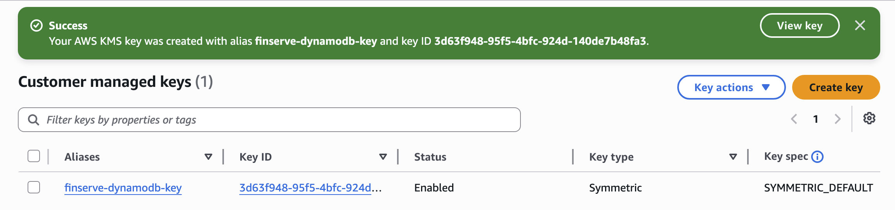
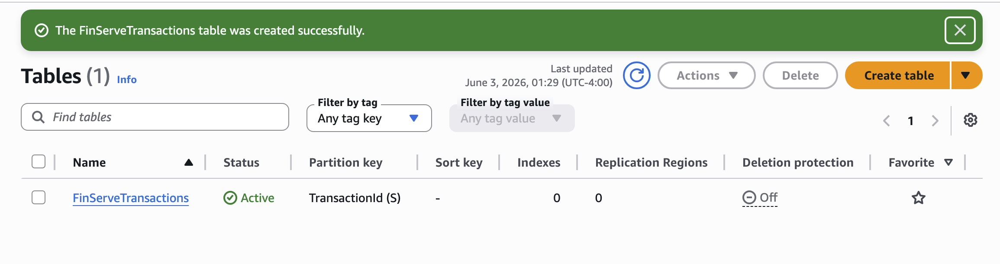
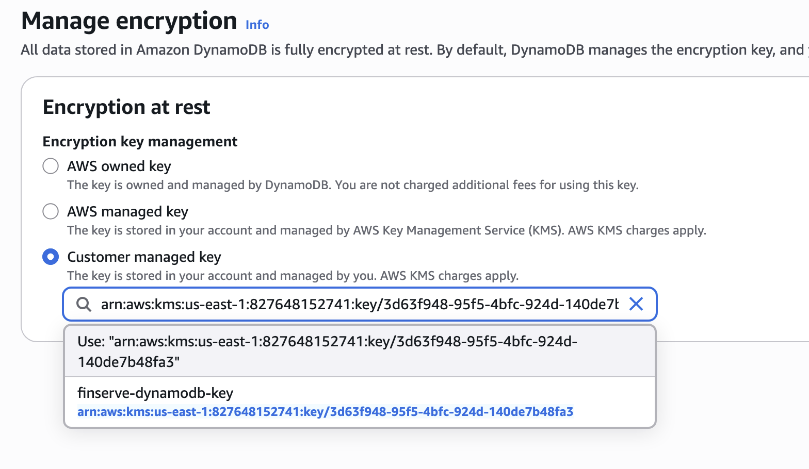
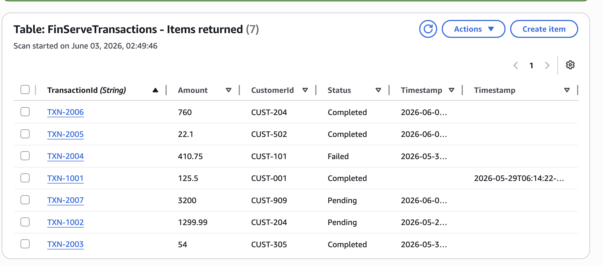
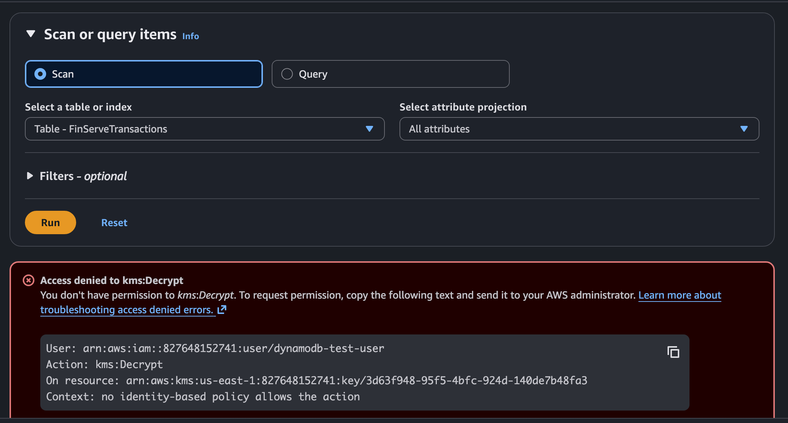

# Encrypting Financial Data with AWS KMS (FinServe Scenario)

## Summary

In this project, I stepped into the role of a simulated Cloud Security Engineer at a fictional fintech company called FinServe, where protecting customer financial data is a critical business requirement. To secure sensitive transaction records, I designed and implemented an encryption-based access control model using AWS Key Management Service (KMS), DynamoDB, and IAM.

The objective was not only to encrypt data at rest, but also to validate that unauthorized users could not decrypt protected information even if they had access to the underlying database. By combining customer-managed encryption keys with least-privilege IAM permissions, I created a realistic cloud security scenario that mirrors how organizations protect sensitive financial data in production environments.

---

## Problem & Objective

FinServe stores customer transaction data in Amazon DynamoDB. Because the company operates in a highly regulated industry, customer financial records must be protected from unauthorized access.

The challenge was to ensure that:

- Sensitive transaction data is encrypted at rest.
- Only approved users can decrypt protected information.
- Employees with database access cannot automatically view encrypted data.
- Encryption controls remain effective even when users have legitimate access to the DynamoDB table.

My objective was to build and test a security model that separates database access from decryption permissions, ensuring that only authorized identities can view sensitive information.

---

## What I Designed

### Customer-Managed Encryption Architecture

- Created a customer-managed AWS KMS key.
- Configured DynamoDB to use the KMS key for table encryption.
- Protected FinServe transaction records using encryption at rest.

### Least-Privilege Access Model

- Created a test IAM user representing a FinServe employee.
- Granted DynamoDB access while intentionally withholding KMS permissions.
- Designed permissions so the user could access the table but could not decrypt protected data.

### Security Validation Workflow

- Logged in as the restricted user.
- Attempted to read encrypted transaction records.
- Verified that KMS blocked decryption requests through explicit permission enforcement.

---

## What I Built Step-by-Step

### 1. Created a Customer-Managed KMS Key

I created a symmetric encryption key using AWS Key Management Service (KMS).

This key serves as the root of trust for protecting FinServe's financial transaction data and provides greater control over auditing, permissions, and key management than AWS-managed encryption keys.

### 2. Encrypted a DynamoDB Table

I configured a DynamoDB table containing transaction records to use my customer-managed KMS key.

This ensures that all stored data is encrypted at rest and protected by a key that I fully control.

### 3. Verified Encryption Behavior

After enabling encryption, I accessed the table using my administrator account.

Although the data was encrypted at rest, DynamoDB automatically decrypted the records because my identity had permission to use the KMS key.

This demonstrated how AWS performs transparent encryption for authorized users.

### 4. Created a Restricted Test User

To simulate a real-world employee account, I created a separate IAM user with:

- Full DynamoDB access
- No KMS permissions

This allowed me to test whether encryption controls were truly protecting sensitive information.

### 5. Tested Unauthorized Access

After logging in as the restricted user, I attempted to access the encrypted table.

The request failed with a:

`kms:Decrypt Access Denied`

error.

Although the user could access the DynamoDB table itself, AWS prevented decryption because the user lacked permission to use the KMS key.

### 6. Validated Encryption Enforcement

This test confirmed that:

- DynamoDB permissions alone are not enough to access encrypted data.
- KMS evaluates decryption requests separately.
- Users require explicit authorization to decrypt protected information.

This demonstrates how AWS enforces security controls at the encryption layer rather than solely at the database layer.

---

## Results & Impact

The security model successfully protected FinServe's sensitive financial records through encryption and least-privilege access controls.

Key outcomes included:

- Sensitive transaction data was encrypted at rest.
- Unauthorized users could not decrypt protected records.
- Database access and decryption permissions were separated.
- Customer-managed encryption keys provided granular control over sensitive information.
- The solution aligned with security practices commonly used in regulated industries such as finance and healthcare.

---

## Security & Cloud Concepts Applied

- AWS Key Management Service (KMS)
- Customer-Managed Encryption Keys
- Encryption at Rest
- DynamoDB Encryption
- Identity and Access Management (IAM)
- Least Privilege (PoLP)
- Separation of Duties
- Access Control Enforcement
- Key Policies vs IAM Policies
- Secure Data Protection Architecture

---

## Challenges & Learnings

The most challenging part of this project was understanding the relationship between DynamoDB permissions and KMS permissions.

Initially, it seemed counterintuitive that a user with full DynamoDB access could still be blocked from reading data. Through testing, I learned that DynamoDB controls access to the database itself, while KMS controls access to the encryption key.

The most valuable lesson was seeing AWS deny a decryption request with a `kms:Decrypt` error. This demonstrated that encryption is more than simply enabling a setting—it is a security control enforced through identity, permissions, and key management.

This project gave me a much deeper understanding of how encryption, IAM, and cloud security services work together to protect sensitive data in real-world environments.

---

## Looking Ahead

Next, I plan to continue building cloud security projects focused on:

- AWS IAM best practices
- Infrastructure as Code (AWS SAM & CloudFormation)
- CloudTrail auditing and monitoring
- AWS GuardDuty threat detection
- Security incident response workflows
- Advanced KMS and key rotation strategies

---

## 📸 Screenshots

Below are the screenshots documenting the AWS KMS and DynamoDB encryption workflow.

### 1. Creating the Customer-Managed KMS Key

### 2. DynamoDB Table Successfully Created

### 3. Configuring DynamoDB Encryption

### 4. Viewing Encrypted DynamoDB Data as Administrator

### 5. Creating the Restricted IAM User

### 6. Access Denied - kms:Decrypt Error

